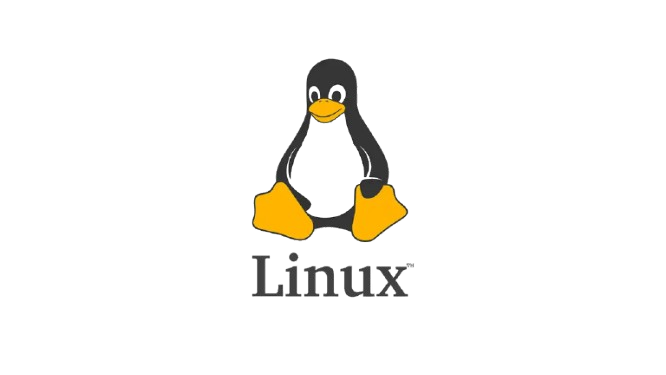
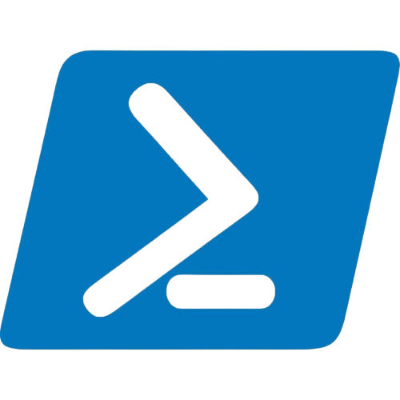

# Binaryx

## O que é?

Binaryx é um programa de terminal "command line interface" (CLI) de conversão de números de bases númericas e foi criado usando a linguagem de programação C e feito em ambiente Linux com suporte ao ambiente Windows.

O programa é simples e atualmente conta com apenas um comando primário que converte "convert" números de bases númericas e conta com 3 bases númericas disponíveis: decimal, binário e hexadecimal.

## Compilação e instalação no PATH

O software conta com APIs e funções que auxiliam o código fonte: "main.c" e que no momento do download precisam ser compilados e o arquivo executável precisa ser adicionado ao PATH do sistema.

Para a compliação e instalação do programa ao PATH do sistema, o software conta com ferramentes que dependem do sistema operacional do usuário, para MacOS e Linux utiliza-se a ferramenta Makefile e o arquivo bash "setup.sh" e para o sistema Windows utiliza-se o script powershell "build.ps1".  

### Download:

Para fazer o download das pastas e dependências do binaryx, pode-se utilizar o git clone ou o download da pasta zip

1. git clone:

SSH

```git clone git@github.com:igorruiz123-py/binaryx.git```

HTTPS

```git clone https://github.com/igorruiz123-py/binaryx.git```

2. pasta zip:

Na página do repositório do projeto do github, acesse:

```Code -> Download ZIP ```

### Instalação Linux e MacOS:

No diretório do projeto execute os seguintes comandos:

```./setup.sh```

```make all```

```make install```

Veja se o programa foi adicionado ao PATH (se nenhum erro for disparado, o programa está adicionado ao PATH):

```which binaryx```

### Instalação Windows (powershell):

No diretório do projeto execute os seguintes comandos:

```unblock-file ./build.ps1```

```./build.ps1 all```

```./build.ps1 install```

Veja se o programa foi adicionado ao PATH (se nenhum erro for disparado, o programa está adicionado ao PATH):

```Get-Command binaryx```

#### Comandos disponíveis para Makefile:

(Esteja no diretório do projeto e tenha acesso ao arquivo de compilação "Makefile")

1. Compilação dos arquivos fontes C

```make all```

2. Instalação do programa executável "binaryx" ao PATH do sistema

```make install```

3. Desinstalação do programa executável "binaryx" do PATH do sistema

```make uninstall```

4. Remoção dos arquivos fontes C do diretório do projeto

```make clean```

#### Comandos disponíveis para build.ps1 (powershell)

(Esteja no diretório do projeto e tenha acesso ao arquivo powershell "build.ps1")

1. Compilação dos arquivos fontes C

```./build.ps1 all```

2. Instalação do programa executável "binaryx.exe" ao PATH do sistema

```./build.ps1 install```

3. Desinstalação do programa executável "binaryx.exe" do PATH do sistema

```./build.ps1 uninstall ```

4. Remoção dos arquivos fontes C do diretório do projeto

```./build.ps1 clean```

## Como o binaryx funciona?

Assim que o programa estar adicionado ao PATH do sistema, para executa-lo é simples, abra um terminal, ou se estiver no Windows, abra o powershell ou o cmd e a estrutura do comando segue o padrão:

"<nome do programa> <comando de conversão> <número a ser convertido> <base de origem> <base de destino>"

Exemplos:

```binaryx convert 10 decimal binary```

```binaryx convert 10 binary hexadecimal```

Veja mais em: docs/guide.txt

### Erros

Caso a sintaxe do programa não for respeitado, um erro com um código do erro será disparado, por outro lado, caso o usuário não respeite o número a ser convertido relacionado com sua base de origem, por exemplo: "binaryx convert string decimal binary" um erro com seu respectivo código será disparado também.

Veja mais em: docs/error_codes.txt

## Tecnologias utilizadas:

<p>
            
</p>  